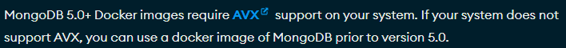
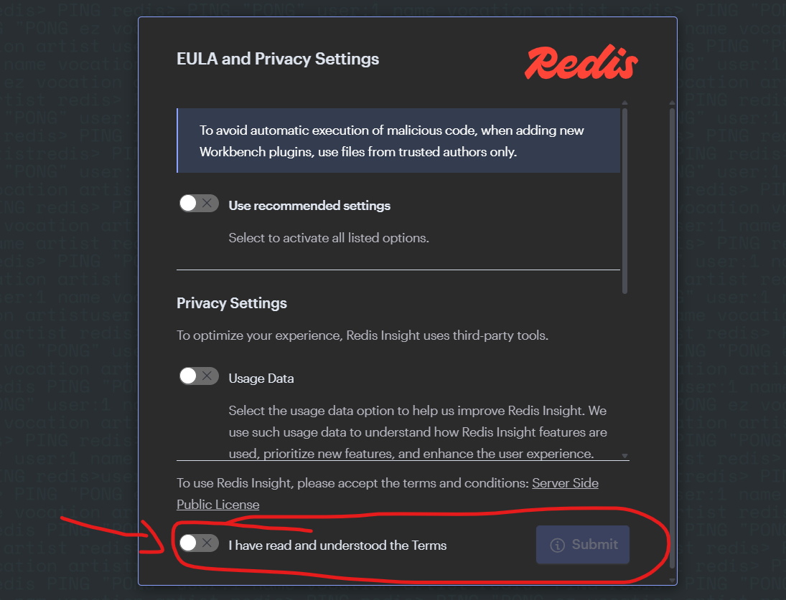
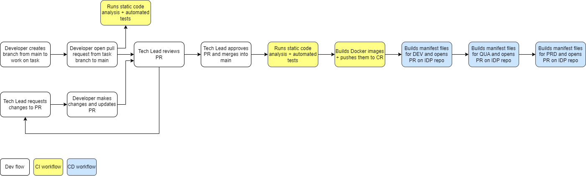

# .Net Toolkit
The .Net Toolkit is split into multiple packages:
- **Base .Net Toolkit**: Intended to be used in non Asp.Net application
- **Asp.Net Toolkit**: Intended to be used in Asp.Net application

## Main functionalities
- Handles setting up the connections with MongoDb, Redis, Kafka and LaunchDarkly
- Exposes functionality to perform most operations on this tech stack while abstracting the implementation details of each technology
- Standardizes the interactions with this tech stack across all the applications that use this package
- Reduces the cost of evolving the interaction with this tech stack across all the applications

**Note:** This package does not intend to completely abstract, from the application, the technology being used.
The application will still need to interact with some data types from the underlying technologies.

# Technical information
For detailed information about each package look at:
| Package | Documentation |
| ----------- | ----------- |
| Base .Net Toolkit | [doc](/src/Toolkit/README.md) |
| Asp.Net Toolkit | [doc](/src/Toolkit.Asp/README.md) |

# Developer information
## Requisites
To develop in this application you will need, at a minimum, to have installed in your system the following:
- [Docker](https://docs.docker.com/manuals/) with Compose
- [AVX](https://en.wikipedia.org/wiki/Advanced_Vector_Extensions) support in your system 

## Update project dependencies
To inspect or update the dependencies used in the projects inside this repository run the following command, from the root of the repository
```sh
sh cli/dependencies_update.sh [flags]
```
Where:

**flags:**<br>
- `-u` | `--update`: For each dependency that can be updated, identify it and ask if it should be updated

## Local development environment
This repository contains a local development environment, fully containerised, that can be used to run the application on your machine and test it.

**NOTE:** Use of a unix command line environment is recommended.

### Run the local environment
To run the local environment follow these steps:

1. From the root of the project run the command
```sh
sh cli/start.sh [flags] [services]
```
Where:

**flags:**<br>
Any flag supported by the `Docker compose up` command.<br>
For more information consult the official Docker [documentation](https://docs.docker.com/reference/cli/docker/compose/up/).<br>
**NOTE:** Consider using the `-d` flag, which runs the Docker project in detached mode.

**services:**<br>
Whitespace separated list of services to run.<br>
The available services are declared in the local environment Docker compose project at `setup/local/docker-compose.yml`.<br>
**NOTE:** If no services are provided, all services will be started.

This will run a Docker compose project and start several networked Docker containers will all the services and necessary tools to use the application.

The following services will be running in the containers:
- 1 MongoDb instance
- 1 Redis single node instances
- Confluent community edition Kafka Broker
- Confluent Schema Registry
- A GUI for MongoDb
- A GUI for Redis
- A GUI for Kafka

2. **[OPTIONAL]** From the root of the project run the command
```sh
sh cli/start_elk.sh [services]
```
Where:

**services:**<br>
Whitespace separated list of services to run.<br>
The available services are declared in the local environment ELK Docker compose project at `setup/local/docker-compose.elk.yml`.<br>
**NOTE:** If no services are provided, all services will be started.

This will run a Docker compose project and start several networked Docker containers will all the services and necessary tools to use an ELK stack.

The following services will be running in the containers:
- 1 Elasticsearch instance
- 1 Logstash instance
- 1 Kibana instance

**NOTE:** Elasticsearch takes a few minutes to start and be ready to receive information, which means if you send logs before it is ready then those logs will be lost.<br>
In order to confirm if the ELK stack is ready run the command
```sh
docker ps -a
```
And check if the `elasticsearch` and `logstash` services are `healthy`.

3. Interact with the local environment via the following URLs:

`MongoDb GUI`: [http://localhost:9000](http://localhost:9000) (user: appUser | pw: appPw)

`Redis GUI`: [http://localhost:9001](http://localhost:9001)<br>
**NOTES:**<br>
Accept the T&C and submit to enter.


Add the following databases:<br>
`redis://default@redis:6379`<br>

`Kafka GUI`: [http://localhost:9002](http://localhost:9002)<br>
**NOTES:**<br>
Add a topic with the name `myTestTopic` with, at least, 1 partition.
Register the `myTestTopic-key` and `myTestTopic-value` schemas, using the contents of the files `setup/local/tester_kafka_schema_key.json` and `setup/local/tester_kafka_schema_value.json`, respectively.

`Kibana`: [http://localhost:9003](http://localhost:9003)

`Test API`: [http://localhost:10000](http://localhost:10000)<br>

`Test API Swagger UI`: [http://localhost:10000/swagger](http://localhost:10000/swagger)

### Stop the local environment
From the root of the project run the command
```sh
sh cli/stop.sh
```
This will stop the Docker compose project and cleanup its resources.

### Configure the local environment
To configure some of the parameters of the local environment follow these steps:

1. Copy the file `setup/local/.env.template` to `setup/local/.env`
2. Fill in the parameters you want to overwrite and delete the ones you want to keep the defaults
3. Run the local environment

## Testing the application
From the root of the project run the command
```sh
sh cli/test.sh [flags] [projects]
```
Where:

**flags:**
- `-w`: Run the tests in watch mode (Requires at least 1 project to be specified)
- `--unit`: Run only unit tests
- `--integration`: Run only integration tests
- `--e2e`: Run only end to end tests
- `--docker`: Run the tests in a Docker container
- `--filter`: Run only the tests that match the provided [xunit filter](https://learn.microsoft.com/en-us/dotnet/core/testing/selective-unit-tests?pivots=xunit)
- `--coverage`: Run the unit tests with coverage report using the [coverlet collector](https://github.com/coverlet-coverage/coverlet)

**projects:**<br>
Whitespace separated list of test `.csproj` to run.

### Generating test coverage reports
To generate unit test coverage reports, including an HTML report, from the root of the project run the command
```sh
sh cli/coverage.sh [flags]
```
Where:

**flags:**
- `--docker` Build the coverage report in a Docker container

Each test project's coverage report will be located inside a directory named `TestResults`, inside each test project's directory.

The HTML coverage report is located inside the directory `./coverageReport`, which contains an `index.html` file.

## CI/CD lifecycle
This project uses the reusable pipeline templates for .Net package build artifacts located at `https://github.com/PedroHenriques/ci_cd_workflow_templates` and follows the work flow below.


The CI/CD pipeline has the following triggers:

`Pull request`
- `opened`, `edited`, `reopened` and `synchronize` will trigger:
  - CI workflow's static code analysis and automated tests
- `closed` with a merge to the `main` branch will trigger:
  - CI workflow's static code analysis and automated tests
  - CI workflow's build of the package and push to the remote package registry